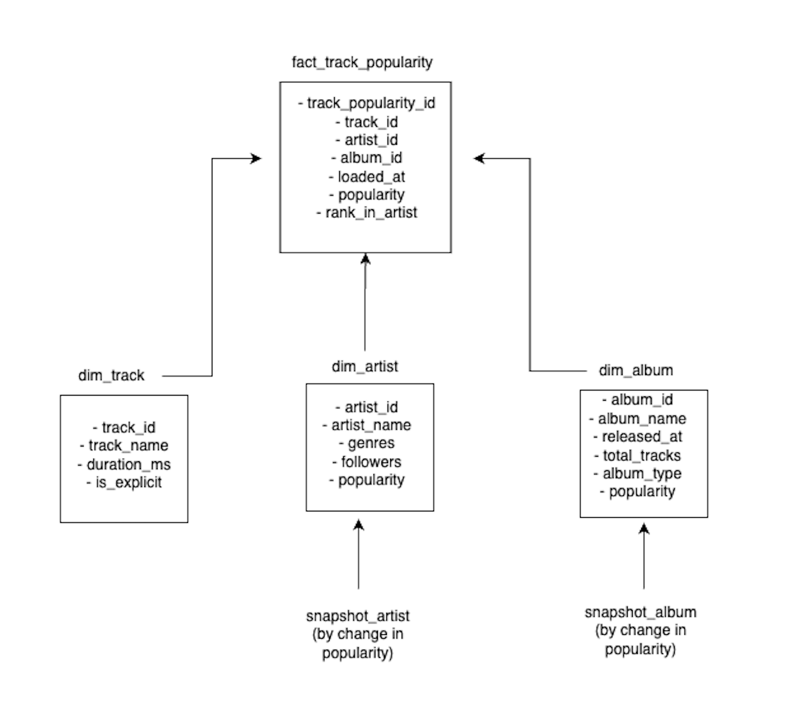

# spotify_popularity_pipeline

**End-to-end data pipeline** for extracting, transforming, and modeling popularity data from the Spotify API, using **Apache Airflow**, **DBT**, **DuckDB**, and **Streamlit**.

---

## ✨ Overview

This project showcases a modern data engineering pipeline that ingests music data from the Spotify API, processes it incrementally using Airflow and DBT, and visualizes insights in a lightweight dashboard built with Streamlit.

It is designed as a portfolio project, focusing on clean architecture, modularity, and best practices.

---

## 🧱 Architecture

The pipeline follows a **medallion architecture** with the following layers:

- **Raw layer:** CSV files stored locally, representing the unprocessed data as received from the Spotify API.
- **Staging layer:** Lightweight, non-historical tables refreshed daily with current data only.
- **Analytics layer:** A dimensional model composed of fact and dimension tables, optimized for analysis.

All data is stored and queried using **DuckDB**, enabling fast analytical queries and local development.

---

## 🛠️ Technologies Used

| Tool           | Description                                                                 |
|----------------|-----------------------------------------------------------------------------|
| Airflow        | Orchestrates ingestion and transformation tasks. A DAG with a **Dataset dependency** ensures `dbt build` runs only after ingestion is complete. |
| DBT            | Handles data modeling, including **custom tests** and **snapshots** for tracking historical changes. |
| Python         | Ingestion logic is tested with **unit tests using pytest**. |
| Streamlit      | Simple web app to visualize track popularity trends over time.              |
| DuckDB         | In-process OLAP database used for all data storage and transformations.     |

---

## 📦 Data Flow

1. **Ingestion DAGs** in Airflow fetch daily data on artists, albums, and tracks from the Spotify API.
2. Files are stored as CSV under a local `./data/raw/` directory.
3. A **Dataset-based DAG** triggers `dbt build` after ingestion completes.
4. **DBT models** transform this data into a clean staging layer and then into a **dimensional star schema**.
5. A **Streamlit dashboard** provides a simple interface to explore track popularity over time.

---

## 🧪 Testing

- **Unit tests** written using `pytest` validate the ingestion process and CSV formatting.
- **DBT tests**, including **custom assertions**, validate data quality and transformation logic.
- **Snapshots** capture historical changes in selected entities.

---

## 📊 Dashboard

A minimal dashboard was built with **Streamlit** to visualize key metrics from the analytics layer.

🔗 [spotify-popularity-dashboard.streamlit.app](https://spotify-popularity-dashboard.streamlit.app/)

---

## 📐 Data Model

The analytics layer follows a **star schema**, with a central fact table `fact_track_popularity` and supporting dimension tables:  
- `dim_artist`
- `dim_album`
- `dim_track`

